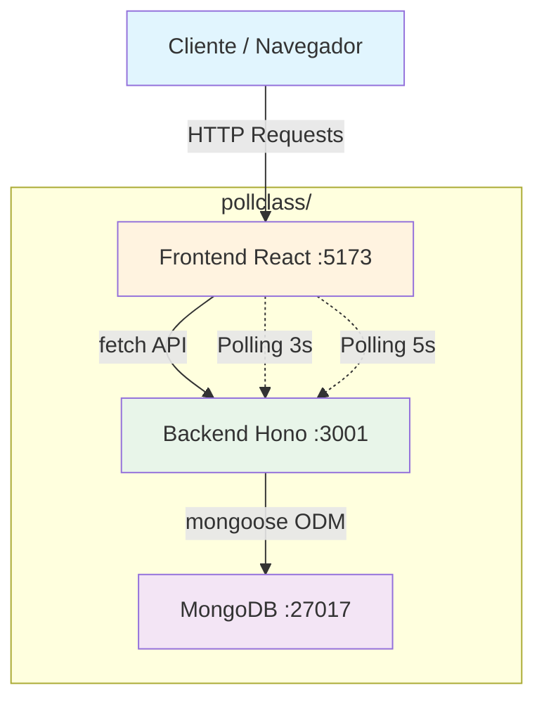
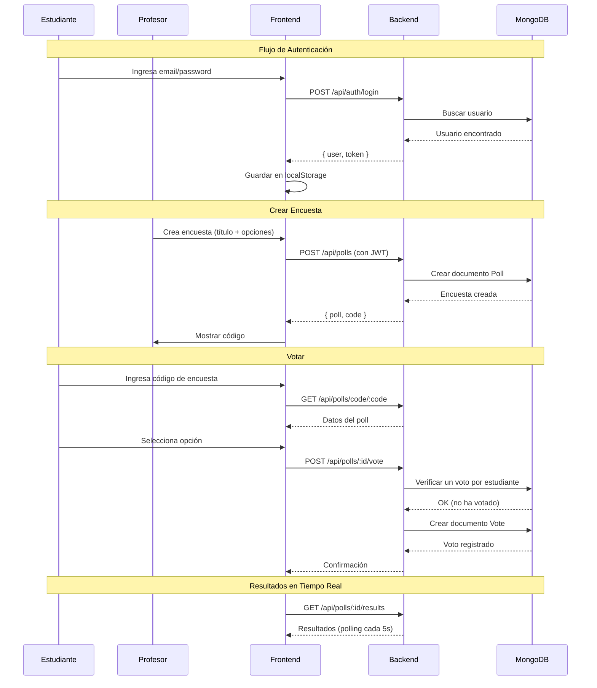
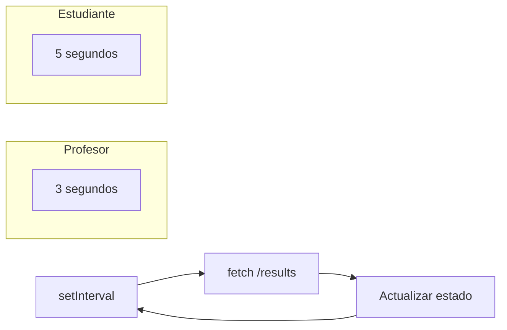
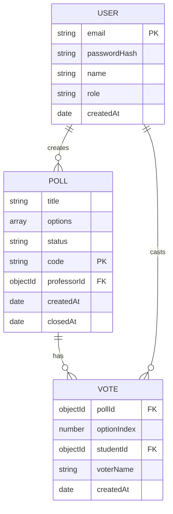
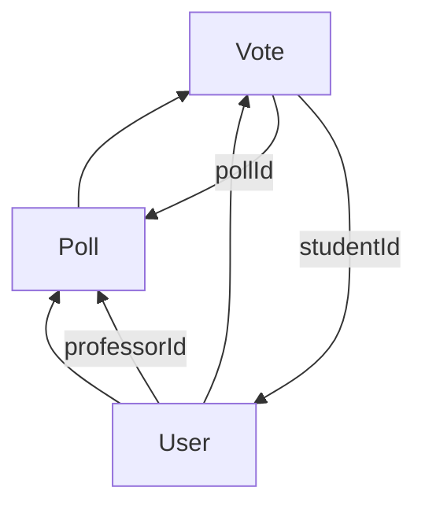
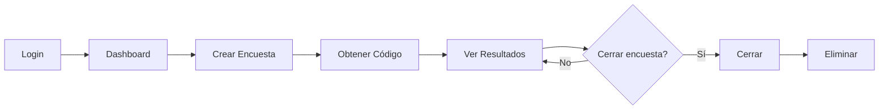
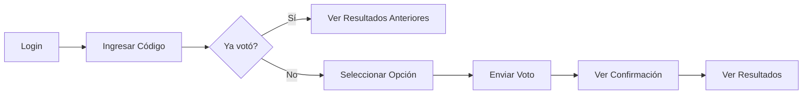

# Documentación de Infraestructura - PollClass

## 1. Descripción General del Sistema

### 1.1 Qué es PollClass

**PollClass** es una aplicación web de encuestas en tiempo real diseñada para entornos educativos. Permite a los profesores crear encuestas durante una clase y a los estudiantes participar desde sus propios dispositivos móviles.

### 1.2 Objetivo del Sistema

- Eliminar la necesidad de votar manualmente o usar papel
- Permitir participación simultánea de toda la clase
- Mostrar resultados en tiempo real sin necesidad de instalar aplicaciones
- Funcionar en red local (no requiere internet)

### 1.3 Problema que Resuelve

En entornos educativos tradicionales, las votaciones se realizan de forma manual:
- Profesor pregunta en voz alta
- Estudiantes levantan la mano
- Profesor cuenta votos manualmente

PollClass automatiza este proceso:
- Profesor crea encuesta → genera código de 6 caracteres
- Estudiantes ingresan código → votan
- Ambos ven resultados actualizados en tiempo real

### 1.4 Componentes Principales

| Componente | Tecnología | Puerto |
|------------|------------|--------|
| **Frontend** | React 18 + Vite + Tailwind | 5173 |
| **Backend** | Bun + Hono + TypeScript | 3001 |
| **Base de Datos** | MongoDB + Mongoose | 27017 |

---

## 2. Arquitectura del Sistema

### 2.1 Diagrama de Arquitectura



### 2.2 Flujo de Comunicación



### 2.3 Stack Tecnológico

| Capa | Tecnología | Descripción |
|------|-------------|-------------|
| **Frontend** | React 18 + Vite | UI reactiva |
| **Estilos** | Tailwind CSS | Diseño brutalist |
| **Gráficos** | Recharts | Gráficos de resultados |
| **Backend** | Bun + Hono | Runtime + Framework |
| **Tipo** | TypeScript | Tipado estático |
| **DB** | MongoDB + Mongoose | NoSQL + ODM |
| **Auth** | JWT + bcryptjs | Autenticación |
| **Real-time** | HTTP Polling | No WebSockets |

---

## 3. Comunicación entre Servicios

### 3.1 Frontend → Backend

El frontend se comunica con el backend usando **fetch API nativo** (no Axios).

```javascript
// Ejemplo de llamada GET
const response = await fetch(`${API_BASE_URL}/api/polls`, {
  headers: {
    'Authorization': `Bearer ${token}`
  }
});
```

### 3.2 Endpoints de la API

#### Autenticación (`/api/auth`)

| Método | Endpoint | Descripción | Auth |
|--------|----------|-------------|------|
| POST | `/register` | Crear usuario | No |
| POST | `/login` | Iniciar sesión | No |
| GET | `/me` | Obtener usuario actual | Sí (JWT) |

#### Encuestas (`/api/polls`)

| Método | Endpoint | Descripción | Auth |
|--------|----------|-------------|------|
| POST | `/` | Crear encuesta | Sí (JWT) |
| GET | `/` | Obtener mis encuestas | Sí (JWT) |
| GET | `/code/:code` | Obtener encuesta por código | No |
| GET | `/:id/for-student` | Poll para estudiante | No |
| GET | `/:id` | Obtener encuesta por ID | Sí (JWT) |
| PATCH | `/:id/close` | Cerrar encuesta | Sí (JWT) |
| DELETE | `/:id` | Eliminar encuesta | Sí (JWT) |

#### Votos (`/api/polls/:pollId`)

| Método | Endpoint | Descripción | Auth |
|--------|----------|-------------|------|
| POST | `/vote` | Emitir voto | Sí (JWT) |
| GET | `/results` | Obtener resultados | No |

### 3.3 Sistema de Polling

Para actualizar resultados en tiempo real sin WebSockets, se usa **HTTP polling**:



**ProfessorPoll.jsx:**
```javascript
useEffect(() => {
  const interval = setInterval(fetchResults, 3000);
  return () => clearInterval(interval);
}, [pollId]);
```

**Student.jsx:**
```javascript
useEffect(() => {
  const interval = setInterval(fetchResults, 5000);
  return () => clearInterval(interval);
}, [pollId]);
```

### 3.4 Validación de Voto Único

El sistema garantiza que cada estudiante vote una sola vez por encuesta:

```typescript
// Vote.ts - Índice único
voteSchema.index({ pollId: 1, studentId: 1 }, { unique: true });

// Backend - Manejo de error 409
try {
  await vote.save();
} catch (error) {
  if (error.code === 11000) {
    throw new Error('Ya has votado en esta encuesta');
  }
}
```

### 3.5 Flujo Completo de Datos

```mermaid
flowchart TD
    A[Usuario entra a Landing] --> B{Selecciona rol}
    B -->|Profesor| C[/professor/login]
    B -->|Estudiante| D[/student/login]
    
    C --> E[Ingresa credenciales]
    D --> E
    
    E --> F[POST /api/auth/login]
    F --> G{Valida usuario}
    G -->|OK| H[Devuelve JWT]
    G -->|Error| I[Muestra error]
    
    H --> J[Guarda token en localStorage]
    J --> K[Redirige a dashboard]
    
    K --> L{Es profesor?}
    L -->|Sí| M[Dashboard = /dashboard]
    L -->|No| N[Dashboard = /student]
    
    M --> O[Crear / Ver / Cerrar encuestas]
    N --> P[Ingresar código / Votar]
```

---

## 4. Estructura de Base de Datos

### 4.1 Modelos de Datos

#### User (Usuario)

```typescript
// server/models/User.ts
{
  email: String (único, minúsculas),
  passwordHash: String,
  name: String,
  role: 'professor' | 'student',
  createdAt: Date
}
```

#### Poll (Encuesta)

```typescript
// server/models/Poll.ts
{
  title: String,
  options: [
    {
      text: String,
      votes: Number (default: 0)
    }
  ],
  status: 'active' | 'closed',
  code: String (único, 6 mayúsculas),
  professorId: ObjectId (ref: User),
  createdAt: Date,
  closedAt: Date
}
```

#### Vote (Voto)

```typescript
// server/models/Vote.ts
{
  pollId: ObjectId (ref: Poll),
  optionIndex: Number,
  studentId: ObjectId (ref: User),
  voterName: String,
  createdAt: Date
}
```

### 4.2 Diagrama ER



### 4.3 Relaciones entre Modelos



---

## 5. Estructura del Proyecto

### 5.1 Vista General

```
pollclass/
├── client/                    # Frontend React
├── server/                    # Backend Bun + Hono
├── docs/                      # Documentación
│   └── infrastructure/         # Este documento
├── tests/                     # Tests E2E Playwright
├── screenshots/               # Capturas de test
├── videos/                    # Videos de test
├── package.json               # Scripts raíz
├── playwright.config.js       # Config Playwright
├── CONTEXT.md                # Contexto técnico
├── PLAYWRIGHT.md             # Docs tests
└── README.md                 # README principal
```

### 5.2 Frontend (`client/`)

```
client/
├── src/
│   ├── components/
│   │   ├── design/           # Componentes UI: Button, Card, Input
│   │   ├── ConfirmModal.jsx  # Modal de confirmación
│   │   ├── JoinPoll.jsx      # Unirse con código
│   │   ├── PollCard.jsx      # Card de encuesta
│   │   ├── PollForm.jsx      # Form crear encuesta
│   │   ├── PollResults.jsx   # Resultados con gráfico
│   │   ├── ProtectedRoute.jsx # Rutas protegidas
│   │   └── VoteForm.jsx      # Formulario votar
│   ├── context/
│   │   └── AuthContext.jsx   # Estado global auth
│   ├── pages/
│   │   ├── Landing.jsx       # Página principal
│   │   ├── LoginProfessor.jsx
│   │   ├── LoginStudent.jsx
│   │   ├── RegisterProfessor.jsx
│   │   ├── RegisterStudent.jsx
│   │   ├── Professor.jsx     # Dashboard profesor
│   │   ├── ProfessorPoll.jsx # Resultados detalle
│   │   └── Student.jsx      # Dashboard estudiante
│   ├── services/
│   │   └── api.js            # Cliente API
│   ├── App.jsx               # Router principal
│   └── main.jsx              # Entry point
├── .env                      # VITE_API_BASE_URL
├── tailwind.config.js
└── vite.config.js
```

**Responsabilidades:**
- **UI**: Renderizar componentes, manejar estados locales
- **Auth**: Login, registro, logout, protección de rutas
- **API**: Llamadas al backend con JWT
- **Polling**: Actualización automática de resultados

### 5.3 Backend (`server/`)

```
server/
├── src/
│   └── index.ts              # Entry point Hono
├── models/
│   ├── User.ts              # Modelo usuario
│   ├── Poll.ts              # Modelo encuesta
│   └── Vote.ts              # Modelo voto
├── routes/
│   ├── auth.ts              # Endpoints auth
│   ├── polls.ts             # Endpoints encuestas
│   ├── votes.ts             # Endpoints votos
│   └── student.ts           # Endpoints estudiante
├── middleware/
│   ├── auth.ts              # JWT verify, requireRole
│   └── errorHandler.ts      # Manejo errores
├── config/
│   └── db.ts                # Conexión MongoDB
└── utils/
    └── generateCode.ts      # Generador código 6 chars
```

**Responsabilidades:**
- **API REST**: Endpoints para auth, polls, votes
- **Auth**: JWT generation, verification, role check
- **DB**: Conexión MongoDB, operaciones CRUD
- **Validations**: Un voto por estudiante, polls propios, etc.

---

## 6. Flujos Principales del Sistema

### 6.1 Flujo del Profesor



**Pasos:**
1. **Login**: `/professor/login` → `/api/auth/login`
2. **Dashboard**: Ver lista de encuestas → `/api/polls`
3. **Crear**: Título + opciones → POST `/api/polls`
4. **Código**: Se genera automáticamente (6 caracteres)
5. **Resultados**: Polling cada 3s → GET `/api/polls/:id/results`
6. **Cerrar**: PATCH `/api/polls/:id/close`
7. **Eliminar**: DELETE `/api/polls/:id`

### 6.2 Flujo del Estudiante



**Pasos:**
1. **Login**: `/student/login` → `/api/auth/login`
2. **Unirse**: Ingresa código → GET `/api/polls/code/:code`
3. **Verificar**: ¿Ya votó? → GET `/api/polls/:id/for-student`
4. **Votar**: Selecciona opción → POST `/api/polls/:id/vote`
5. **Confirmación**: Muestra opción elegida
6. **Resultados**: Polling cada 5s

### 6.3 Estados del Estudiante en una Encuesta

| Estado | Descripción | Trigger |
|--------|-------------|---------|
| `join` | Pantalla para unirse | Default |
| `vote` | Formulario de votación | No ha votado |
| `already-voted` | Ya votó, ver resultados | Ya votó |
| `results` | Resultados en tiempo real | Después de votar |

---

## 7. Infraestructura y Ejecución Local

### 7.1 Requisitos

- **Node.js**: v18+
- **Bun**: Latest (opcional, para desarrollo)
- **MongoDB**: Running locally

### 7.2 Puertos de Servicio

| Servicio | Puerto | URL |
|----------|--------|-----|
| Frontend | 5173 | http://localhost:5173 |
| Backend | 3001 | http://localhost:3001 |
| MongoDB | 27017 | mongodb://localhost:27017/pollclass |

### 7.3 Variables de Entorno

**Backend (`server/.env`):**
```
DATABASE_URL=mongodb://localhost:27017/pollclass
JWT_SECRET=your-secret-key
PORT=3001
```

**Frontend (`client/.env`):**
```
VITE_API_BASE_URL=http://localhost:3001
```

### 7.4 Cómo Ejecutar

```bash
# Opción 1: Con npm (recomendado)
npm run dev

# Opción 2: Con Bun
bun run dev
```

Esto inicia:
- Backend en `localhost:3001`
- Frontend en `localhost:5173`

### 7.5 Iniciar Servicios Manualmente

```bash
# 1. MongoDB (Windows)
net start MongoDB

# 2. Backend
cd server && npm run dev

# 3. Frontend (otro terminal)
cd client && npm run dev
```

---

## 8. Decisiones Técnicas

### 8.1 Polling vs WebSockets

**Decisión**: Usar HTTP polling en lugar de WebSockets.

**Razón del requerimiento**:
- El usuario específicamente solicitó "NO WebSockets"
- Simplicidad de implementación
- Funciona en redes con restricciones de puertos
- Menos recursos del servidor

**Trade-offs**:
- ✅ Más simple de implementar
- ✅ Mejor compatibilidad con proxys/firewalls
- ❌ Mayor latencia (3-5 segundos)
- ❌ Más carga en servidor (más requests)

### 8.2 Stack Elegido

| Tecnología | Justificación |
|------------|----------------|
| **React 18** | UI reactiva, componente base |
| **Vite** | Desarrollo rápido, hot reload |
| **Tailwind CSS** | Diseño rápido, consistente |
| **Bun** | Runtime rápido, bundling integrado |
| **Hono** | Framework ligero, similar a Express |
| **MongoDB** | Flexible para encuestas, rápido |
| **Mongoose** | ODM con validación de schemas |
| **JWT** | Stateless auth, escalable |

### 8.3 Diseño Brutalist

El sistema usa un diseño **brutalist**:
- Bordes gruesos (2-4px)
- Sombras sólidas
- Sin border-radius
- Alto contraste
- Colores primarios

**Justificación**: Estilo distintivo, fácil de implementar, legible.

---

## 9. Mejoras Futuras

### 9.1 Tiempo Real con WebSockets

Reemplazar polling con WebSockets para latencia menor:

```typescript
// Ejemplo con Socket.io
io.on('connection', (socket) => {
  socket.on('vote', (data) => {
    io.emit('new-vote', data);
  });
});
```

### 9.2 Escalabilidad

- **Base de datos**: Considerar replicas set para producción
- **Caché**: Redis para cachear resultados de polls populares
- **Colas**: Bull/Jobs para procesamiento de votos asíncrono

### 9.3 Seguridad

- **HTTPS**: Obligatorio en producción
- **Rate limiting**: Prevenir abuso de API
- **Input validation**: Zod o Yup para validación
- **CSRF protection**: Tokens csrf

### 9.4 Despliegue (Cloud)

**Opciones recomendadas:**
- **Frontend**: Vercel, Netlify
- **Backend**: Railway, Render, Fly.io
- **DB**: MongoDB Atlas

### 9.5 Features Adicionales

- [ ] Exportar resultados (CSV, PDF)
- [ ] Preguntas de respuesta abierta
- [ ] Temporizador de投票
- [ ] Modo anónimo
- [ ] Analytics por pregunta

---

## 10. Glosario

| Término | Definición |
|---------|------------|
| **Poll** | Encuesta activa con opciones de voto |
| **Código** | Identificador de 6 caracteres para unirse |
| **Voto** | Opción seleccionada por un estudiante |
| **Polling** | Requests HTTP periódicos para actualizar datos |
| **JWT** | Token de autenticación sin estado |
| **Brutalist** | Estilo de diseño con bordes gruesos y alto contraste |

---

## 11. Referencias

- [React Documentation](https://react.dev)
- [Hono Framework](https://hono.dev)
- [MongoDB](https://www.mongodb.com)
- [Mongoose ODM](https://mongoosejs.com)
- [Tailwind CSS](https://tailwindcss.com)
- [Playwright](https://playwright.dev)

---

## 12. Tests E2E con Playwright

### 12.1 Resumen

La aplicación incluye **19 tests automatizados** end-to-end que verifican los flujos principales de usuario y validaciones de seguridad.

### 12.2 Estructura de Tests

```
tests/
├── fixtures.js              # Helpers reutilizables
├── professor.spec.js       # 7 tests - flujo profesor
├── student.spec.js          # 7 tests - flujo estudiante
└── security-roles.spec.js  # 6 tests - seguridad y roles
```

### 12.3 Cobertura de Tests

| Suite | Tests | Flujos |
|-------|-------|--------|
| professor.spec.js | 7 | Registro, login, crear/cerrar encuestas, eliminar, resultados, logout |
| student.spec.js | 7 | Registro, login, código inválido, unirse, votar, resultados, voto duplicado |
| security-roles.spec.js | 6 | Rutas protegidas, aislamiento de roles, logout |

### 12.4 Comandos de Ejecución (con Bun)

```bash
# Ejecutar todos los tests
bun run test:e2e

# Ejecutar suites específicas
bun run test:professor   # 7 tests - flujo profesor
bun run test:student    # 6 tests - flujo estudiante
bun run test:security   # 6 tests - seguridad y roles

# Modo headed (navegador visible)
bun run test:e2e:headed

# Interfaz gráfica de Playwright
bun run test:e2e:ui

# Ver reporte HTML
bun run test:e2e:report
```

### 12.5 Documentación Adicional

- **PLAYWRIGHT.md** - Documentación completa de tests E2E
- **AGENTS.md** - Bitácora agéntica del laboratorio 5

### 12.6 Notas

- Las carpetas `playwright-report/` y `test-results/` se generan automáticamente al ejecutar tests
- Ambas carpetas deben ignorarse en git (.gitignore)
- Los tests usan emails únicos generados con timestamp para evitar colisiones

---

*Documento generado automáticamente para el proyecto PollClass*